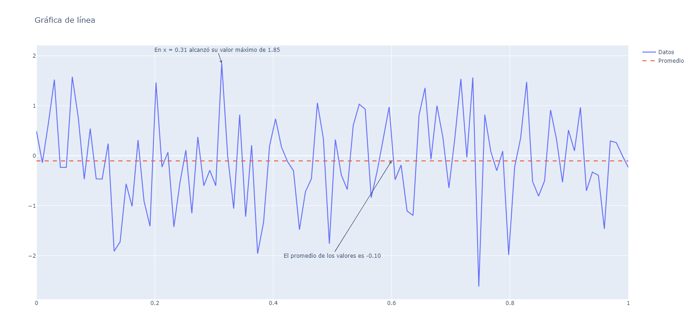
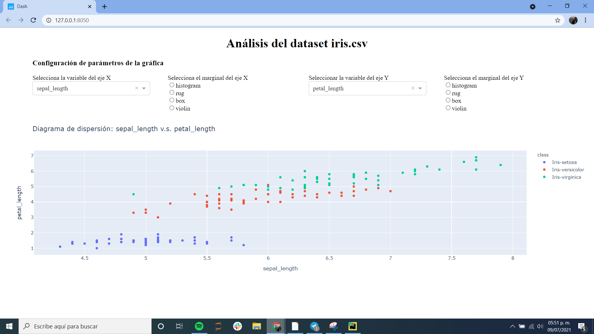

# py


## links


- [Introduction to Python: Absolute Beginner](https://www.edx.org/es/course/introduction-to-python-absolute-beginner) (edX).
- [Introducción al desarrollo de aplicaciones web](https://learning.edx.org/course/course-v1:UAMx+WebApp+1T2019a/)(edx) ** de aqui es la documentacion

- [Curso de Python Básico Gratis](https://codigofacilito.com/cursos/Python) (Web Código Facilito).


## venv


requirements.txt

```
flask
```


```bash
pk@pk:~$ type vvvv
vvvv () 
{ 
    deactivate;
    python3.8 -m venv ./.venv;
    source ./.venv/bin/activate;
    pip install -r requirements.txt;
    python app.py
}
pk@pk:~$ 
pk@pk:~$ 

```


## flask
### ejemplo basico
app.py

```python
import sys

from flask import Flask,request
app = Flask(__name__)


@app.route('/')
def index():
    user_agent = request.headers.get('User-Agent')
    return '<p>Your browser is %s</p>' % user_agent

@app.route('/processLogin', methods=['POST'])
def process_login():
       missing = []
       fields = ['email', 'passwd', 'login_submit']
       for field in fields:
              value = request.form.get(field, None)
              if value is None:
                  missing.append(field)
       if missing:
              return "Warning: Some fields are missing"

       return '<!DOCTYPE html> ' \
           '<html lang="es">' \
           '<head>' \
           '<link href="static/css/my-socnet-style.css" rel="stylesheet" type="text/css"/>' \
           '<title> Home - SocNet </title>' \
           '</head>' \
           '<body> <div id ="container">' \
           '<a href="/"> SocNet </a> | <a href="home"> Home </a> | <a href="login"> Log In </a> | <a href="signup"> Sign Up </a>' \
           '<h1>Data from Form: Login</h1>' \
           '<form><label>email: ' + request.form['email'] + \
           '</label><br><label>passwd: ' + request.form['passwd'] + \
           '</label></form></div></body>' \
           '</html>'


if __name__ == '__main__':
    if sys.platform == 'ubuntu':  
        app.run(debug=True, port=8080)
    else:
        app.run(debug=True, port=80)
```

index.html

```

```


### flask. ejem buenisimo api json

```python
'''
http://127.0.0.1:8080/songs/all


import requests
cancion={
    'Artista':'dfasfd',
    'Nombre':'jojo'
}

respuesta=requests.get('http://127.0.0.1:8080/songs/all')
print('\n',respuesta.content.decode())

respuesta=requests.post('http://127.0.0.1:8080/songs/new',json=cancion)
print('\n',respuesta.content.decode())

respuesta=requests.get('http://127.0.0.1:8080/songs/all')
print('\n',respuesta.content.decode())

respuesta=requests.patch('http://127.0.0.1:8080/songs/2', json={'Artista':'jijiji'})
print('\n',respuesta.content.decode())

respuesta=requests.get('http://127.0.0.1:8080/songs/all')
print('\n',respuesta.content.decode())


'''


# Ejemplo API
from flask import Flask, request, jsonify
import json

app = Flask(__name__)

song_db = [
    {
    "id": 0,
     "Artista": "Air Supply",
     "Nombre": "Making Love Out of Nothing at All"
     },
     {
     "id": 1,
     "Artista": "Bonnie Tyle",
     "Nombre": "Total Eclipse Of The Heart"
     },
     {
     "id": 2,
     "Artista": "George Michael",
     "Nombre": "Careless Whisper"
     },
     {
     "id": 3,
     "Artista": "Berlin",
     "Nombre": "Take My Breath Away"
     },
     {
     "id": 4,
     "Artista": "Queen",
     "Nombre": "Bohemian Rhapsody"
     }
 ]


# GET | returns the whole catalog
@app.route("/songs/all", methods=["GET"])
def get_all():
    return jsonify(song_db), 200

# GET | returns an entry by an id


@app.route("/songs/<int:song_id>", methods=["GET"])
def get_song(song_id):
    song_result = next(
        (song for song in song_db if song["id"] == song_id), None)

    if song_result:
        return (jsonify(song_result), 200)
    else:
        return "404 Not Found", 404
# GET | returns all songs with the same name


@app.route("/songs/search/<string:song_name>", methods=["GET"])
def search_song(song_name):
    songs = [song for song in song_db if song_name in song["Nombre"]]

    if songs:
        return (jsonify(songs), 200)
    else:
        return "404 Not Found", 404

# POST | creates a new entry in the catalog


@app.route("/songs/new", methods=["POST"])
def post_song():

    if request.data:
        song_data = json.loads(request.data)

        song_id = max([song['id'] for song in song_db])+1
        song_artist = song_data["Artista"]
        song_name = song_data["Nombre"]

        new_song = {
            "id": song_id,
            "Artista": song_artist,
            "Nombre": song_name
  	  }

        song_db.append(new_song)

        return jsonify(new_song), 200
    else:
        return "400 Bad Request", 400

# DELETE | deletes an entry in the catalog by an id


@app.route("/songs/<int:song_id>", methods=["DELETE"])
def delete_song(song_id):

    for idx, song in enumerate(song_db):
        if song["id"] == song_id:
            song_db.pop(idx)

            return "Register Deleted", 200

    return "Not Found", 404

# PUT | replaces an entry in the catalog, creates a new entry if it doesn't exist


@app.route("/songs/<int:song_id>", methods=["PUT"])
def put_song(song_id):
    if request.data:
         song_data = json.loads(request.data)

         song_artist = song_data["Artista"]
         song_name = song_data["Nombre"]

         edit_song = {
             "id": song_id,
             "Artista": song_artist,
             "Nombre": song_name
     	}

         for idx, song in enumerate(song_db):
             if song["id"] == song_id:
                 song_db[idx] = edit_song

                 return (jsonify(edit_song), 200)

         edit_song["id"] = max([song['id'] for song in song_db])+1
         song_db.append(edit_song)

         return (jsonify(edit_song), 200)
    else:
         return "Bad Request", 400
 
  
# PATCH | edits an entry in the catalog, fails if it doesn't exist
@app.route("/songs/<int:song_id>", methods = ["PATCH"])
def patch_song(song_id):
    if request.data:
        for idx, song in enumerate(song_db):
            if song["id"] == song_id:
                song_data = json.loads(request.data)
               
                for edit_key in song_data:
                	song[edit_key] = song_data[edit_key]
               
                return (jsonify(song), 200)
    	
        return "Not Found", 404
    else:
        return "Bad Request", 400

if __name__=='__main__':
    app.run(debug=True, port=8080)


```


## json


Las estructuras de JSON tienen una traducción directa a estructuras Python:

- Los objetos JSON son representados como diccionarios en Python
- Los arrays JSON son representados como listas en Python
- true y false en JSON son valores del tipo *boolean* en Python
- Las cadenas en JSON son cadenas en Python
- Los números en JSON son *float* o *integer*, según corresponda, en Python

Por este motivo, las funciones para leer y escribir ficheros JSON son muy sencillas de utilizar. En ambos casos recurrimos a la biblioteca  JSON, así que lo primero que debemos hacer es:

```
import json
```

### Lectura

La función para leer un fichero JSON es json.load. Como parámetro un fichero, así que una forma normal de usarla es:

```
with open(“nombre_fichero.json”, 'r') as f:
   data = json.load(f)
```

Después de ejecutar esto, la variable *data* contendrá un  diccionario con los datos cargados del fichero. Si por ejemplo  hubiéramos cargado el fichero con los datos del usuario *James*  visto en la sección anterior, ahora data[‘user_name’] sería “James” y  data[‘messages’] sería una lista Python con los mensajes publicados por  James.

### Escritura

Volcar una estructura Python a un fichero JSON es igual de sencillo.  Supongamos que tenemos la siguiente inicialización de la variable datos:

```json
datos = {
    "user_name": "James",
    "password": “007”,
    "messages": [(1532648502.113984, “mensaje 1”), (1532648642.729385,     “mensaje 1”)],
    "email": session['email'],
    "friends": session['friends']
}
```

Entonces guardar los datos en el fichero correspondiente sería:

```python
with open(“james.bond@mi6.uk”, 'w') as f:
    json.dump(datos, f)
```


## sesiones


Ya hemos dicho en varias  oportunidades que el protocolo HTTP no tiene estado, que no recuerda.  ¿Qué significa eso en la práctica? Que necesitamos información adicional para implementar una “conversación” entre cliente y servidor. Esta idea de conversación, donde ambas partes recuerdan lo que han hablado hasta  el momento, se llama **sesión**.

Aunque el concepto o la duración de una sesión puede variar en distintos entornos, básicamente es el conjunto de interacciones entre cliente y servidor en un lapso de tiempo razonable.

La primera vez que un cliente realiza una petición, después de un tiempo sin interactuar, el servidor **abre una sesión**. Las subsecuentes peticiones desde ese cliente se consideran dentro de  la misma sesión. Si pasa mucho tiempo sin que el cliente realice una  petición, el servidor asume que ya no está conectado y termina la  sesión.

La biblioteca Flask nos ofrece este concepto de sesión. Pero si HTTP  no tiene información específica que permita identificar al usuario o la  sesión, ¿cómo sabe Flask a qué usuario corresponde una determinada  petición?

Existen al menos 3 formas de que una petición HTTP transporte información que permita identificar al usuario o la sesión:

- **Cookies**: las *cookies* son pequeños ficheros que se adjuntan a una respuesta HTTP, con información de identificación de usuario. En sucesivas peticiones HTTP, el navegador incluye ese  fichero automáticamente, por lo que el servidor podrá tener la  identificación de ese usuario.
- **Campos ocultos**: en los formularios que el servidor envía a cliente para que sean completados, incluyo un campo del tipo *input* que no se muestra al usuario; ese campo lleva información que cuando  los datos del formulario se envíen de vuelta al servidor le servirá para identificar al cliente.
- **Reescritura de URLs**: aunque nos parezcan iguales,  el servidor introduce automáticamente pequeñas modificaciones a las  URLs; de esta forma, la URL específica que solicite permitirá al  servidor identificar al cliente.

La buena noticia es que, generalmente, el mecanismo que se use para  transportar la información de sesión no es visible al desarrollador de  la aplicación web. Esto es exactamente lo que ocurre con el soporte de  sesiones que nos ofrece Flask, y que veremos a continuación.


Vamos a ver cómo podemos  manejar una sesión en Python y Flask para poder almacenar información  entre cada una de las peticiones que el cliente haga al servidor.

### Objeto Flask Session

El objeto que nos guarda la información entre sesiones se llama  session. Lo primero será importarlo dentro de nuestro código Python para luego poder usarlo:

```
from flask import Flask, session
```

Como la información de la sesión viaja del servidor al cliente ida y  vuelta, es importante que nadie en el camino, ni siquiera el propio  cliente, puedan alterar esa información. En particular, se debe evitar  que alguien de fuera “tome control” de la sesión. En seguridad  informática, este tipo de ataque se conoce como CSRF (Cross-site request forgery) o robo de sesión.

Para asegurarse que eso no ocurre, Flask utiliza técnicas de  encriptación para proteger la información. Para eso, necesita una clav  de encriptación/desencriptación. Esta clave, que sólo debe conocer el  servidor y que debe ser distinta para todos los programas servidor, se  crea en el propio código del servidor. Por ejemplo:

```
app.secret_key = 'esto-es-una-clave-muy-secreta'
```

De hecho, en el código de nuestra aplicación SocNet habrás visto una línea similar a esta:

```
app.secret_key = 'A0Zr98j/3yX R~XHH!jmN]LWX/,?RT'
```

Ahora ya sabes para qué sirve. Si quieres tener más información de  este problema de seguridad informática y su solución, puedes leer [aquí](http://flask.pocoo.org/snippets/3/).


Ahora vamos a ver ejemplo de cómo utilizamos las sesiones en nuestra aplicación favorita.

La primera función, ***load_user(email, passwd)\***, intenta cargar los datos desde un fichero.

**Importante**: aquí almacenamos los datos en un fichero por una cuestión de  simplicidad. En aplicaciones con cientos o miles de usuarios lo normal  es almacenar los datos en una base de datos propiamente dicha.

Si el fichero existe, carga los datos y a continuación comprueba que la clave suministrada coincida con la que está almacenada.

**Nota de seguridad**: otra vez, para facilitar las explicaciones y la comprensión de los  conceptos básicos, realizamos algunas simplificaciones que antes de  hacer público un sistema deben ser corregidas. Por ejemplo, nunca se  debe guardar una clave de usuario “en claro”, siempre se debe hacer  codificada con algún algoritmo como por ejemplo SHA-256. Lamentable  estas cuestiones quedan fuera del ámbito de este curso.

Si todas las condiciones son correctas, la función **guarda** los datos relevantes del usuario (nombre, mensajes que ha escrito hasta el momento, la clave, su correo electrónico y la lista de amigos) en la **sesión**, para que estén disponibles para las próxima llamadas desde el cliente.

```python
def load_user(email, passwd):
    """
    It loads data for the given user (identified by email) from the data directory.
    It looks for a file whose name matches the user email
    :param email: user id
    :param passwd: password to check in order to validate the user
    :return: content of the home page (app basic page) if user exists and password is correct
    """
    file_path = os.path.join(SITE_ROOT, "data/", email)
    if not os.path.isfile(file_path):
        return process_error("User not found / No existe un usuario con ese nombre", url_for("login"))
    with open(file_path, 'r') as f:
        data = json.load(f)
    if data['password'] != passwd:
        return process_error("Incorrect password / la clave no es correcta", url_for("login"))
    session['user_name'] = data['user_name']
    session['messages'] = data['messages']
    session['password'] = passwd
    session['email'] = email
    session['friends'] = data['friends']
    return redirect(url_for("home"))
```

De la misma forma, cuando un usuario quiere salir del sistema, debemos guardar los datos en el fichero (base de datos) para que estén disponibles la próxima vez que el  usuario vuelva a nuestra aplicación. Este es el objetivo de la función *save_current_user()*, que vuelca los datos de session en el fichero correspondiente.

Por otra parte, cuando un usuario se da de alta, se debe crear el fichero, previa comprobación que no exista un usuario con el mismo identificador (correo electrónico). Esto es lo que hace la función *create_user_file(name, email, passwd, passwd_confirmation)*.

```

```


```python
def save_current_user():
    datos = {
        "user_name": session["user_name"],
        "password": session['password'],
        "messages": session['messages'], # lista de tuplas (time_stamp, mensaje)
        "email": session['email'],
        "friends": session['friends']
    }
    file_path = os.path.join(SITE_ROOT, "data/", session['email'])
    with open(file_path, 'w') as f:
        json.dump(datos, f)


def create_user_file(name, email, passwd, passwd_confirmation):
    """
    It creates the file (in the /data directory) for storing user data. The file name will match the user email.
    If the file already exists, it returns an error.
    If the password does not match the confirmation, it returns an error.
    :param name: Name or nickname of the user
    :param email: user email, which will be later used for retrieving data
    :param passwd: password for future logins
    :param passwd_confirmation: confirmation, must match the password
    :return: if no error is found, it sends the user to the home page
    """

    directory = os.path.join(SITE_ROOT, "data")
    if not os.path.exists(directory):
        os.makedirs(directory)
    file_path = os.path.join(SITE_ROOT, "data/", email)
    if os.path.isfile(file_path):
        return process_error("The email is already used, you must select a different email / Ya existe un usuario con ese nombre", url_for("signup"))
    if passwd != passwd_confirmation:
        return process_error("Your password and confirmation password do not match / Las claves no coinciden", url_for("signup"))
    datos = {
        "user_name": name,
        "password": passwd,
        "messages": [],
        "friends": []
    }
    with open(file_path, 'w') as f:
        json.dump(datos, f)
    session['user_name'] = name
    session['password'] = passwd
    session['messages'] = []
    session['friends'] = []
    session['email'] = email
    return redirect(url_for("home"))
```


### Iterando sobre los elementos en **Beautiful Soup**


Hasta el momento se han visto dos principales maneras de cómo se  puede utilizar el árbol jerárquico producido por BeautifulSoup con base a una página web: utilizando métodos de búsqueda, y navegando manualmente por los elementos, cada uno con sus ventajas y desventajas. Sin  embargo, podemos utilizar un enfoque intermedio entre estos dos extremos y es el de utilizar métodos de iteración sobre los elementos. De esta  forma podemos tener la ventaja de la flexibilidad de la búsqueda, pero  con el poder de ajustar la selección de los elementos de forma manual.

Para lograr este objetivo, BeautifulSoup cuenta con diferentes herramientas y métodos,siendo uno de ellos el atributo “**descendants**”. Su comportamiento es similar al de “**children**” pero no solo se limita a los elementos inmediatos, si no que enlista  todos los elementos, es decir, los hijos, los hijos de los hijos, etc.

```python
# Ejemplo 1
import requests
from bs4 import BeautifulSoup


page = requests.get(“https://datolok.github.io/python-edx/
webscrapping/simple.html”)
soup = BeautifulSoup(page.content, ‘html.parser’)


for element in soup.descendants:
     print("Element {}: \n {}".format(item, element))
```

En este código se carga la página que se ha utilizado de ejemplo y se imprimen todos los elementos contenidos por medio de un ciclo for. Esto se puede combinar con otros conceptos, como la de expresiones  regulares, para identificar palabras claves o patrones de información.

Este proceso de búsqueda dentro de un elemento en particular puede  aplicarse al resultado de otros procesos como el de búsqueda o  navegación.

```python
# Ejemplo 2
import requests
from bs4 import BeautifulSoup


page = requests.get(“https://datolok.github.io/python-edx/
webscrapping/simple.html”)
soup = BeautifulSoup(page.content, ‘html.parser’)


for p in soup.find_all(“p”):
    if “contenido” in p.get_text():
        print(p.get_text())
```

En este código se encuentran todos los elementos de tipo párrafo  <p> en el documento, se iteran sobre todos los resultados y se  imprimen aquellos que contengan la palabra “contenido”. Como se puede  observar esto abre un abanico de nuevas posibilidades para automatizar  nuestro proceso de búsqueda y no depender demasiado en que la estructura de la página web no varíe.

Igualmente, no estamos limitados a solamente definir nuestro criterio de selección en la iteración con el contenido del texto, también  podemos acceder a los atributos de los elementos utilizando el método  “get()”.

```python
# Ejemplo 3
import requests
from bs4 import BeautifulSoup


page = requests.get(“https://datolok.github.io/python-edx/
webscrapping/simple.html”)
soup = BeautifulSoup(page.content, ‘html.parser’)


for p in soup.find_all(“p”):
    if p.get("class") and "outer-text" in p.get("class")
        print(p.get(“class”),p.get_text())
```


## plotly 

### Proyecto

#### Objetivo

El objetivo del proyecto será explorar, de manera básica, cómo agregar anotaciones en nuestras gráficas generadas con plotly.

En particular, aprenderás cómo agregar anotaciones para señalar puntos específicos de la gráfica de línea que revisamos en el primer  ejemplo de la unidad 5.

##### Instrucciones

Completa las partes faltantes del código para obtener el siguiente resultado:

​	     


La primera parte del código, donde definimos los datos para graficar, es esta:

```pythonLaLaLa
1	import numpy as np
2	import plotly.offline as pyo
3	import plotly.graph_objs as go
4
5	np.random.seed(42)
6	x_values = np.linspace(0, 1, 100)
7	y_values = np.random.randn(100)
8
9	#Calcular el promedio de los valores de y_values
10	y_avg = #Completar1
11
12	#Calcular el valor máximo de y_values
13	y_max = #Completar2
14
15	#Calcular el valor x_y_max tal que (x_y_max, y_max) sea el punto máximo de la gráfica de línea
16	x_y_max = #Completar3
```

Como mencionamos antes, este proyecto inicia igual que el  ejemplo que revisamos en la unidad 5. Las primeras 7 líneas del código  son igual que en dicho ejemplo.

En la línea 10 deberás completar el código para que en la variable `y_avg` sea igual al promedio de los valores del `array y_values`.

En la línea 13 deberás completar el código para que en la variable `y_max` sea igual al valor máximo del `array y_values`.

En la línea 16 deberás completar el código para que la variable `x_y_max` tenga el valor tal que el punto `(x_y_max, y_max)` sea el punto máximo de la gráfica de línea.

Observa que a estas partes faltantes las hemos etiquetado como **#Completar1**, **#Completar2** y **#Completar3**, para poder hacer referencia a ellas después.

La segunda parte del código, donde definimos las gráficas que visualizaremos, es esta:

```python
17
18	trace1 = go.Scatter(x=x_values,
19	                   y=y_values,
20	                   name='Datos',
21	                   mode='lines')
22	
23	#Definir los parámetros x e y de modo que:
24	#Se genere una línea punteada horizontal a la altura del promedio de y_values
25	trace2 = go.Scatter(x=#Completar4,
26	                   y=#Completar5,
27	                   name='Promedio',
28	                   mode='lines',
29	                   line={'dash':'dash'})
30	
31	data = [trace1, trace2]
32	layout = go.Layout(title='Gráfica de línea')
33	fig = go.Figure(data=data, layout=layout)
```

En la línea 18 creamos el `trace1` con un `go.Scatter()`, como vimos en el ejemplo de la unidad 5.

En la línea 25 creamos el `trace2` también con `go.Scatter()`.

Aquí deberás definir de manera apropiada los parámetros x e y (elementos **#Completar4** y **#Completar5**), de modo que el resultado sea una línea punteada horizontal que esté a la altura del promedio de los valores del `array y_values`.

Las líneas 31, 32 y 33 ya las hemos discutido en la unidad 5.

La tercera y última parte del código, donde definimos las anotaciones que mencionamos al principio, es la siguiente:

```python
34
35	#Definir los parámetros x e y de modo que esta anotación apunte al valor máximo de la línea
36	fig.add_annotation(x=#Completar6,
37	                  y=#Completar7,
38	                  text="En x = {:.2f} alcanzó su valor máximo de {:.2f}".format(#Completar6, Completar7),
39	                  showarrow=True,
40	                  arrowhead=5)
41
42	fig.add_annotation(axref='x',
43	                  ayref='y',
44	                  x=0.6,
45	                  y=#Completar8,
46	                  ax=0.5,
47	                  ay=-2,
48	                  text="El promedio de los valores es {:.2f}".format(#Completar8),
49	                  showarrow=True,
50	                  arrowhead=5)
51
52	pyo.plot(fig, filename='line_chart.html')
```

En la línea 36, mediante la función `fig.add_annotation()`, agregamos la primera anotación, que sirve para señalar al punto máximo de la gráfica de línea.

En las líneas 36 y 37, deberás definir de manera apropiada los parámetros x e y para que esta anotación apunte a dicho máximo.

Observa que los elementos **#Completar6** y **#Completar7** también se usan en la línea 38, donde se define el texto de la anotación.

En la línea 42, mediante la función `fig.add_annotation()`, agregamos la segunda anotación, que sirve para señalar a la línea horizontal punteada.

En la línea 45, deberás definir de manera apropiada el  parámetro y para que dicha anotación apunte al punto sobre dicha línea  horizontal punteada donde x=0.6.

Observa que el elemento **#Completar8** también se usa en la línea 48, donde se define el texto de la anotación.


## Introducción a las bases de Dash

#### Dash es una biblioteca para crear tableros puramente en Python.

[ https://dash.plotly.com/introduction](https://dash.plotly.com/introduction)

Las componentes de HTML vienen de `dash_html_components`, que básicamente tiene un componente de Python para cada etiqueta HTML posible. 
      [ https://dash.plotly.com/dash-html-components](https://dash.plotly.com/dash-html-components)

La otra biblioteca es `dash_core_components` que contiene son los componentes centrales, y esta ofrece un sistema de componentes interactivos de nivel superior en el que generará cosas  como JavaScript, HTML y CSS a través de la biblioteca React.JS, todo en  Python. 
      [ https://dash.plotly.com/dash-core-components](https://dash.plotly.com/dash-core-components)

Si deseas ver ejemplos más complejos de lo que se puede lograr con `Plotly+Dash`, te sugerimos revisar la galería: 
      [ https://dash-gallery.plotly.host/Portal/](https://dash-gallery.plotly.host/Portal/)

En general nuestros códigos de las siguientes unidades empezarán importando estos módulos:

```python
 import dash
 import dash_core_components as dcc
 import dash_html_components as html
```

Recuerda que si aún no los tienes instalados, puedes obtenerlos usando, por ejemplo: 

​            `pip install dash`            

desde la terminal en PyCharm.


### Proyecto

#### Objetivo

El objetivo de este proyecto es utilizar elementos que  revisamos durante este módulo 4 para construir un tablero en el que  podamos analizar las variables de uno de los datasets que utilizamos en  el módulo 3, el *dataset iris*.

En particular, nuestro tablero nos permitirá especificar algunos parámetros de un diagrama de dispersión: los *ejes* y los *marginales*.

El resultado final debe verse de esta forma:

​	     


##### Instrucciones

Te presentamos la mayor parte del código para generar el  tablero antes descrito, sin embargo, este código tiene partes faltantes  que deberás completar. Las ubicarás donde hemos colocado etiquetas de  tipo #Completar1.

Esta es la primera parte del código:

```python
1	import dash
2	import dash_core_components as dcc
3	import dash_html_components as html
4	import pandas as pd
5	import plotly.express as px
6	from dash.dependencies import Input, Output
7
8	df = pd.read_csv('Datasets/iris.csv')
9
10	variables = #Completar1
11	marginals = #Completar2
12
13	app = dash.Dash()
```

Las primeras líneas son para importar las bibliotecas necesarias.

En la línea 8 creamos el `dataframe df` leyendo el dataset `iris.csv`.

En la línea 10 deberás definir **#Completar1** de modo que **variables** sirva como el parámetro options de los *dropdowns* que sirven para seleccionar variables del dataframe, con la restricción de que no incluya a la variable 'class'.

En la línea 11 deberás definir **#Completar2** de modo que **marginals** sirva como el parámetro options de los *radio items* que sirven para seleccionar alguno de los cuatro tipo de marginales: `'histogram', 'rug', 'box' y 'violin'`.

Luego, tenemos la segunda parte del código, la más extensa:

```python
15	app.layout = html.Div([html.Div([html.H1('Análisis del dataset iris.csv')],
16	                               style={'textAlign': 'center'}),
17	                      html.Div([html.H3('Configuración de parámetros de la gráfica')],
18	                               style={'marginLeft': '5%'}),
19	                      html.Div([html.Label('Selecciona la variable del eje X'),
20	                                dcc.Dropdown(id='eje-x', options=#Completar3)],
21	                               style={'width': '20%',
22	                                      'marginRight': '3%',
23	                                      'marginLeft': '5%',
24	                                      'verticalAlign': 'top',
25	                                      'display': 'inline-block'}),
26	                      html.Div([html.Label('Selecciona el marginal del eje X'),
27	                                dcc.RadioItems(id='marginal-x', options=#Completar4, labelStyle={'display': 'block'})],
28	                               style={'width': '20%',
29	                                      'marginRight': '4%',
30	                                      'display': 'inline-block'}),
31	                      html.Div([html.Label('Seleccionar la variable del eje Y'),
32	                                dcc.Dropdown(id='eje-y', options=#Completar3)],
33	                               style={'width': '20%',
34	                                      'marginRight': '3%',
35	                                      'verticalAlign': 'top',
36	                                      'display': 'inline-block'}),
37	                      html.Div([html.Label('Selecciona el marginal del eje Y'),
38	                                dcc.RadioItems(id='marginal-y', options=#Completar4, labelStyle={'display': 'block'})],
39	                               style={'width': '20%',
40	                                      'display': 'inline-block'}),
41	                      html.Div([dcc.Graph(id='scatter')])])
```

Observa que en realidad esta parte del código, donde definimos  el layout de nuestro tablero, es extensa debido a que usamos muchos  parámetros de tipo style, para poder darle la forma deseada a nuestro  tablero, pero en realidad este layout tiene cinco elementos principales: `dos dcc.Dropdown()`, `dos dcc.RadioItems()` y un `dcc.Graph()`.

En la línea 20, deberás definir **#Completar3** de modo que el elemento `dcc.Dropdown()` de esa misma línea sirva para poder seleccionar alguna de las variables del dataframe, y que se asigne al eje X.

Observa que en la línea 32 usamos ese mismo elemento para el eje Y.

En la línea 27, deberás definir **#Completar4** de modo que el elemento `dcc.RadioItems()` de esa misma línea sirva para poder seleccionar alguna de las opciones  de marginales que tenemos, y que se asigne al marginal del eje X.

Observa que en la línea 38 usamos ese mismo elemento para el eje Y.

Todos los demás parámetros y elementos ya están definidos, y  puedes modificarlos si gustas, sobre todo si alguno no te queda claro  qué rol está jugando en la distribución de los elementos del tablero,  para explorar.

Para que los elementos del tablero queden distribuidos como te  presentamos previamente, la recomendación es que uses las definiciones  que te proponemos.

Finalmente, la tercera y última parte del código es la siguiente:

```python
43	@app.callback(Output('scatter', 'figure'),
44	             [Input('eje-x', 'value'),
45	              Input('marginal-x', 'value'),
46	              Input('eje-y', 'value'),
47	              Input('marginal-y', 'value')])
48	def update_outputs(vx, mx, vy, my):
49	   fig = px.scatter(df,
50	                    x=#Completar5,
51	                    y=#Completar6,
52	                    color='class',
53	                    marginal_x=#Completar7,
54	                    marginal_y=#Completar8,
55	                    title='Diagrama de dispersión: '+str(#Completar5)+' v.s. '+str(#Completar6))
56	   return fig
57
58	if __name__ == '__main__':
59	   app.run_server()
```

De la línea 43 a la 56 definimos un callback, que recibe los  cuatro valores que el usuario seleccionó en los dropdowns y en los radio items, y actualiza el diagrama de dispersión, y los respectivos  marginales de los ejes.

En la línea 50, deberás definir **#Completar5** de modo que al parámetro x le asignes la variable que el usuario seleccionó en el dropdown del eje X.

En la línea 51, deberás definir **#Completar6** de modo que al parámetro y le asignes la variable que el usuario seleccionó en el dropdown del eje Y.

Observa que esos elementos, **#Completar5** y **#Completar6**, también se usan en la línea 55, para actualizar el título de la gráfica.

En la línea 53, deberás definir **#Completar7** de modo que al parámetro `marginal_x` le asignes la opción de marginal que el usuario seleccionó para el radio item del eje X.

En la línea 54, deberás definir **#Completar8** de modo que al parámetro `marginal_y` le asignes la opción de marginal que el usuario seleccionó para el radio item del eje Y.

Al guardar y ejecutar el código completo, debes obtener un tablero como el que te presentamos al principio.
